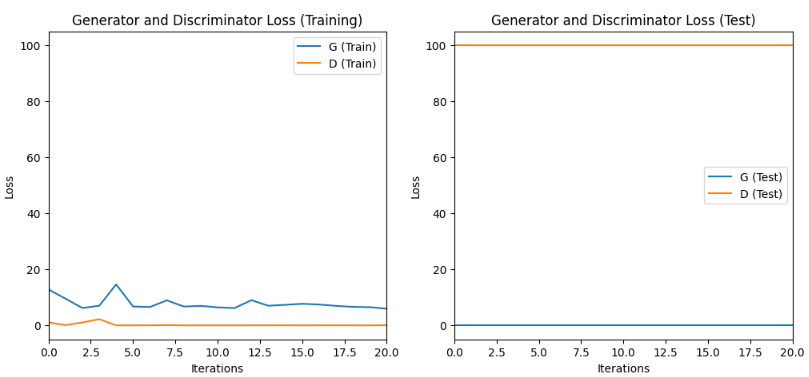
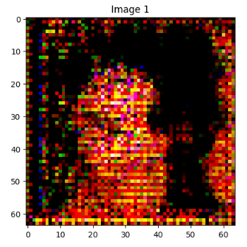

# Имплементация GAN

## Задача, датасет
Задача - реализовать GAN для генерации изображений лиц.
Использовался датасет CelebA, загрузилось 63628 изображений (загружал на гугл диск, он все изображения не смог выгрузить).

## Результаты обучения и эксперименты

### Результаты обучения

В процессе обучения было 5 эпох и размер батча 32 с использованием функции потерь BCELoss и оптимизатоа Adam. Размеры
Отслеживалисть потери генератора и дискриминатора для оценки обучения.

#### Графики потерь

### Пример сгенерированного изображения

### Метрики

- **Loss генератора (train):** ~7
- **Loss дискриминатора (train):** ~1
- **Loss генератора (test):** ~0
- **Loss дискриминатора (test):** ~100

## Выводы

На графиках видно, что генератор испытывает проблемы со сходимостью, а дискриминатор доминирует, что приводит к плохому качеству сгенерированных изображений. Реализованный блок CSP и техники регуляризации помогли улучшить стабильность, но всё ещё можно продолжить улучшение для более качественных результатов.

В дальнейшем можно попробовать:
1. Уменьшить частоту обновления дискриминатора
2. Использовать Dropout для улучшения сходимости
3. Изменить или добавить слои, изменить скорость обучения, параметры оптимизатора.

