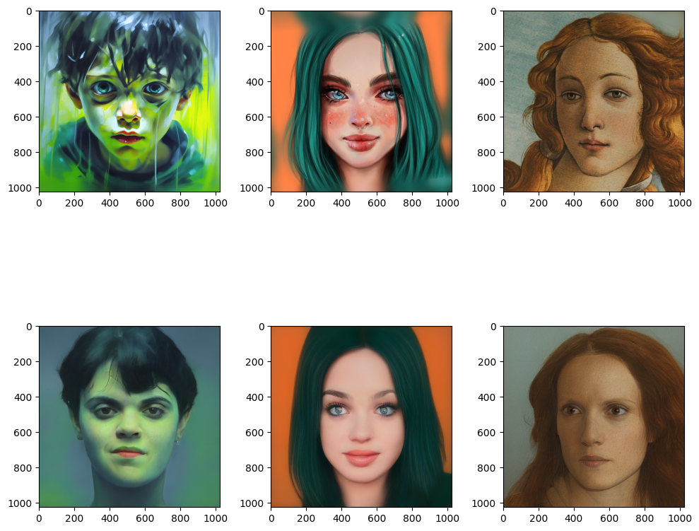
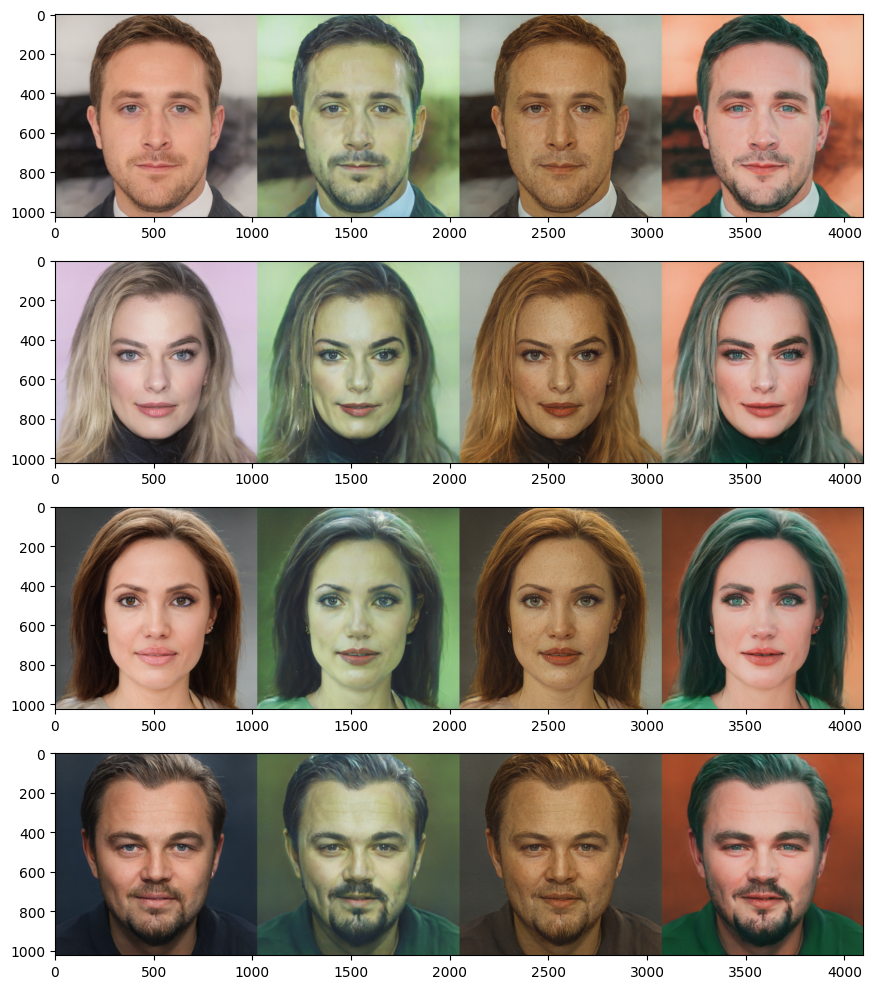
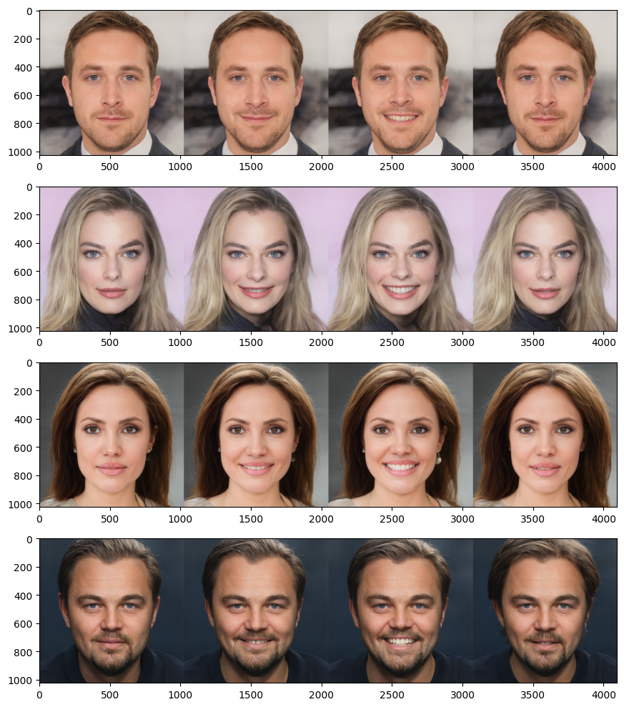
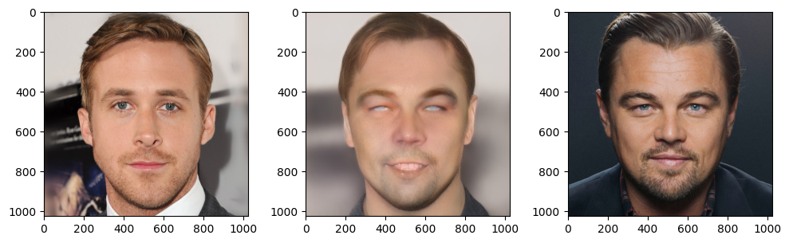
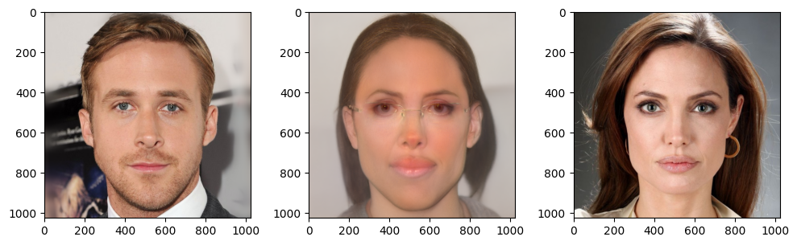
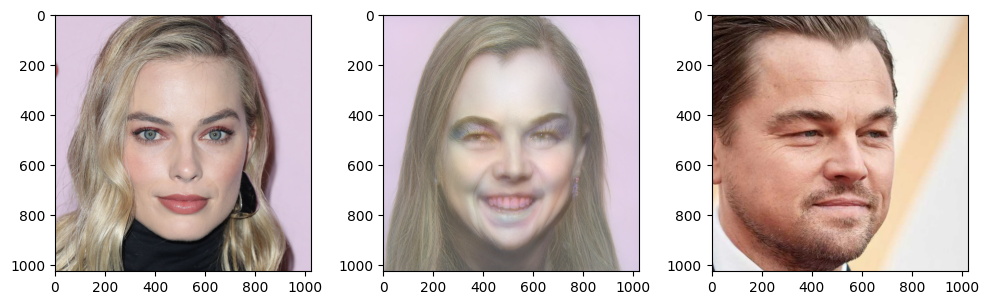
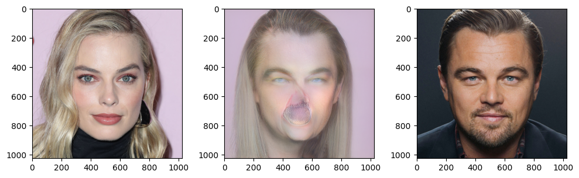

# Глубокие генеративные модели
### Гордеев Клим Евгеньевич
#
# Sampling в латентном пространстве StyleGAN

Преобразование изображений лиц в латентное пространство StyleGAN, перенос стиля, выражений лица и смешивание лиц.

## Подготовительные работы

### Выравнивание изображений (Align images)
Изображения были кадрированы с использованием предобученной модели к одному формату, использовался dlib.

### Проекция изображений в пространство StyleGAN
Для проецирования использовался энкодер e4e и оптимизация векторов в пространстве W+. Для повышения качества была уменьшена скорость обучения, увеличено количество шагов и изменены веса функций потерь.

#### Методы и параметры:
- **Энкодер**: e4e (encoder4editing)
- **Оптимизация**: Adam
- **Функции потерь**:
  - LPIPS
  - L1 Loss 
  - Reg loss
- **Параметры оптимизации**:
  - lr: 0.006
  - Количество шагов: 200
  - LPIPS: 1
  - L1: 0.2
  - Вес регуляризации: 5e5
 
### Результат

## Style Transfer
### Использованные стили

#### Для изменения стиля были выбраны индексы из вектора W+, которые контролируют цвет, свет, текстуру - с 10 по 18.

## Expression Transfer

#### Были выбраны различные изображения с эмоциями.

#### Параметр **λ = 5**.

#### Для переноса выражений лица использовались индексы 4.

### Результат

## Face Swap

### Параметры оптимизации:
- lr: 0.05
- Количество шагов: 180
- LPIPS: 0.9
- L1: 0.4
- Arcface Loss: 0.7

### Результат

- Видны очевидные артефакты в виде неестественных выражений лица. В дальнейшем можно продолжить улучшения алгоритмов оптимизации и функций потерь.

