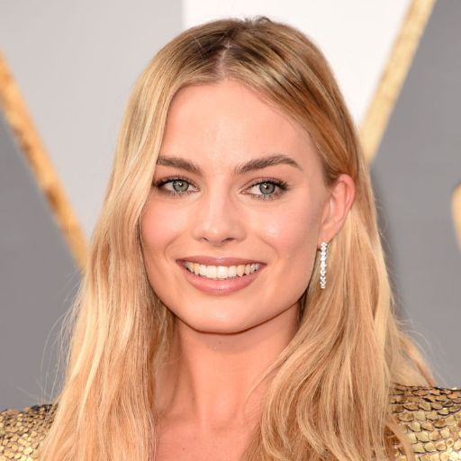
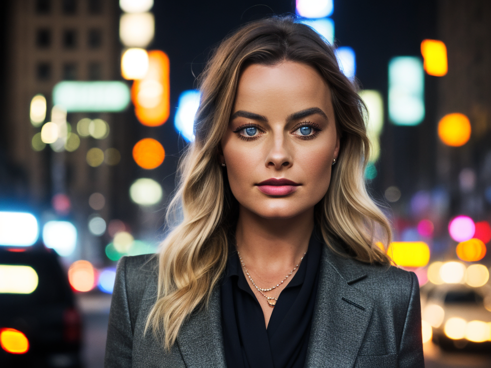
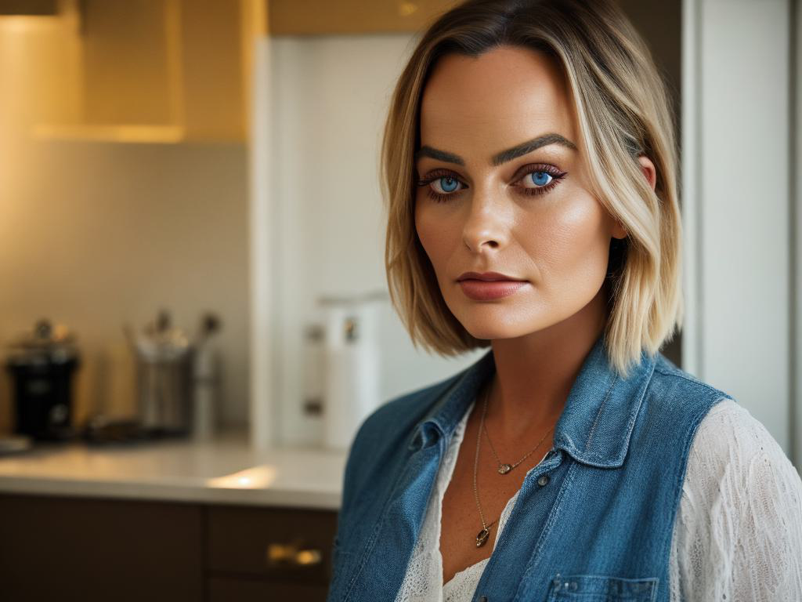
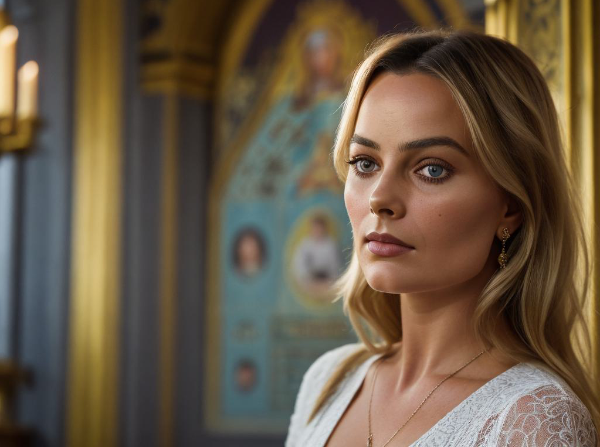

# Глубокие генеративные модели
### Гордеев Клим Евгеньевич
#
# Обучение Stable diffusion 1.5 методом Dreambooth
## Train Unet
### Модель Unet была обучена на изображениях из папки cropped_images (пример в Таблице 1) со следующими параметрами:
- instance_prompt="a photo of sks woman face"
- class_prompt="a photo of woman face"
- with_prior_preservation
- prior_loss_weight=1.0
- resolution=512
- train_batch_size=1
- learning_rate=2e-6
- lr_scheduler="constant"
- lr_warmup_steps=0
- gradient_accumulation_steps=1
- num_class_images=500
- max_train_steps=800
- checkpointing_steps=800
- use_8bit_adam
- mixed_precision="no"
- train_text_encoder 

### Изображения для обучения

### Параметры инференса:

- seed = 345252
- prompt = "portrait of sks woman face, on the street, lights, midnight, NY, standing, raw, hd, high quality, realism, detailed light eyes"
- negative_prompt = "naked, nsfw, deformed, distorted, disfigured, poorly drawn, bad anatomy, extra limb, missing limb, floating limbs, mutated hands disconnected limbs, mutation, ugly, blurry, amputation"
- num_samples = 2
- guidance_scale = 7.5
- num_inference_steps = 30
- height = 768
- width = 1024

### Результат.

## Train LoRA
Было проведено несколько экспериментов, где изменялись lr и rank в диапазонах 2e-6 - 2e-4 и 2 - 48 соответственно.

Наилучшими оказались lr = 5e-5, rank = 8

### Выводы
- Для успешного применения подхода LoRA необходимо либо уменьшать скорость обучения, либо увеличивать количество шагов обучения по сравнению с исходной моделью.
- Также большое увеличение значения rank может привести к ухудшению качества генерации, поэтому требуется тщательная настройка.

## Сравнение Unet и LoRA
Параметры инференса были аналогичны параметрам из инференса Unet. Слева Unet, справа LoRA.

Промт 1. 

"portrait of sks woman face, in the kitchen, standing, raw, hd, high quality, realism, detailed eyes"

        
Промт 2. 

"portrait of sks woman face, in the forest, standing, raw, hd, high quality, realism, detailed eyes"

Промт 3. 

"portrait of sks woman face, on the street,  midnight, Tokio, standing, raw, hd, high quality, realism, sharp focus,  beautiful eyes, detailed eyes"

Промт 4. 

"portrait of sks woman face, on the beach, day, sea, standing, raw, hd, high quality, realism, detailed eyes"

Промт 5. 

"portrait of sks woman face, in the orthodox church, morning, standing, raw, hd, high quality, realism, detailed eyes"

Качество генерации выше у Unet, переобучения нет.

## ControlNet
Были взяты примеры из ноутбука с теми же позами.

Параметры инференса для Unet и LoRA:

- prompt = "karate character, best quality, extremely detailed, detailed face, blonde european man, anatomically right hands"
- negative_prompt="monochrome, naked, lowres, naked, nsfw, deformed, distorted, disfigured, poorly drawn, bad anatomy, extra limb, missing limb, floating limbs, mutated hands disconnected limbs, mutation, ugly, blurry, amputation"
- num_inference_steps = 30

### Результат

**Unet** 

**LoRA**

